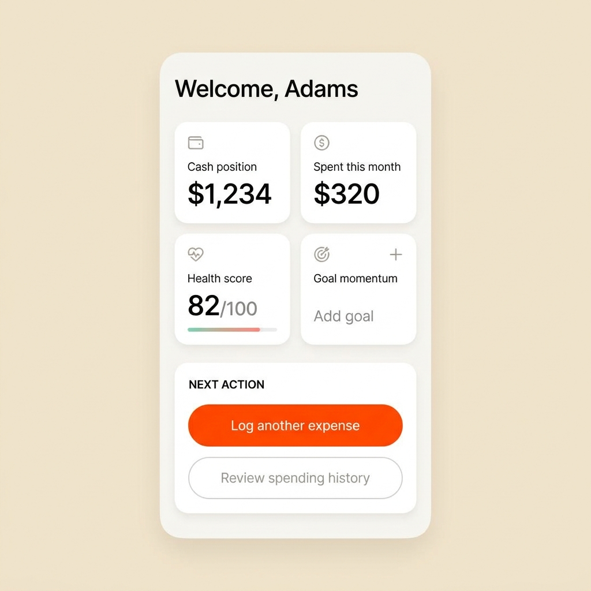

# EVA - Your Personal Finance Compass 🧭💰



EVA is a sophisticated, AI-driven personal finance copilot designed to bring clarity to your spending, planning, and cashflow. It features a shared Supabase backend, a high-performance web app, and a sleek Flutter mobile application.

The core philosophy of EVA is simple:
`Log spending -> See it reflected everywhere -> Get grounded advice -> Take the next action`

---

## 🚀 Key Features

*   **Unified Ecosystem:** A React Web App and a Flutter Mobile App powered by a single Supabase backend.
*   **AI-Powered Insights:** Get personalized, grounded advice on your spending habits and financial goals.
*   **Dashboard & Statements:** View dynamic balance sheets, net worth trackers, and active subscription costs.
*   **Market Intelligence:** Stay informed with live finance news and AI-curated stock picks.
*   **Privacy First:** Strict database row-level security and heavy encryption to protect your data.

## 🏗️ Repository Structure

```text
eva/
├── apps/
│   ├── web/        # Vite + React Web Application
│   └── support/    # Static Help-Center
├── docs/           # Architecture and security documentation
├── supabase/       # Shared Auth, Database, Migrations, Edge Functions
├── LICENSE         # Proprietary licensing notice
└── SECURITY.md     # Security reporting guidelines
```
*(Note: The Flutter mobile app resides in `C:\eva_flutter_app` on local deployments).*

## 📖 Documentation

For detailed insights into how EVA is built, please refer to the following documents:
*   [Architecture Guide](docs/ARCHITECTURE.md): Learn about the system design and edge functions.
*   [Security Policy](SECURITY.md): How we handle your data and how to report vulnerabilities.
*   [Changelog](#changelog): Recent updates and feature rollouts.

## 💻 Local Development (Web App)

The web app lives in `apps/web/`. It requires Node.js and npm.

```bash
cd apps/web
npm ci
npm run dev
```

### Required Environment Variables
Create a `.env` file in `apps/web/` with the following variables:
*   `VITE_SUPABASE_PROJECT_ID`
*   `VITE_SUPABASE_PUBLISHABLE_KEY`
*   `VITE_SUPABASE_URL`

Supabase Edge Function secrets for the Phase E/G launch slice:
*   `UTG_API_BASE_URL=https://utg.useaima.com`
*   `UTG_API_KEY`
*   `EVA_AGENT_AUTOPILOT_ENABLED=true`
*   `EVA_UTG_DISPATCH_ENABLED=true`

## 📱 Local Development (Mobile App)

The mobile app is built with Flutter.

```bash
cd /mnt/c/eva_flutter_app
flutter pub get
flutter run
```

## 🔒 License & Usage

**Proprietary and Confidential.**
This repository and its contents are the intellectual property of EVA (AIMA). This is **not** open-source software. Unauthorized copying, modification, or distribution is strictly prohibited. Please see the [LICENSE](LICENSE) file for complete details.

## 🛡️ Disclaimer

EVA provides informational financial guidance and coaching-style product assistance. It does not provide legal, tax, or professional investment advice. Always consult with qualified professionals before making financial decisions.

---

## 📝 Changelog

### Phase C/D Rollout (Current)
*   **Mobile Parity:** Successfully ported all 9 key screens (Subscriptions, Settings, Financial Statement, Insights, News, Stock Picks, Spending History, Terms, Privacy) to the Flutter app.
*   **Market Integration:** Added real-time finance news and curated stock picks.
*   **Documentation Revamp:** Introduced comprehensive architecture and security documentation.
*   **Dynamic Landing Page:** Added production-ready UI mockups.

### Phase A/B Foundation (Complete)
*   Authenticated signup, signin, and secure email verification.
*   Grounded dashboard, budgets, and goals tracking.
*   Mobile and desktop responsive navigation shell.
